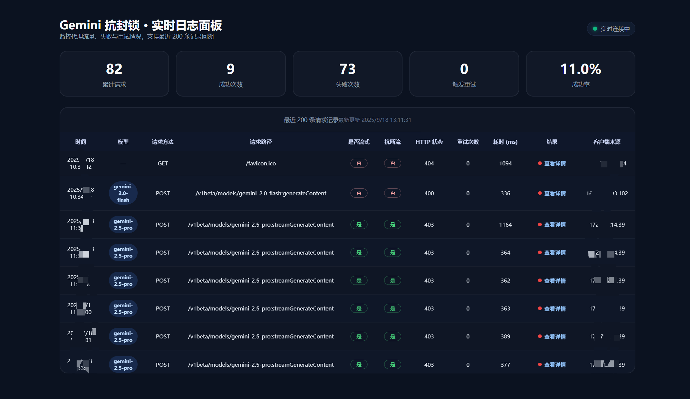

# Gemini Antiblock Proxy (Go 鐗堟湰)


杩欐槸涓€涓敤 Go 璇█閲嶅啓鐨?Gemini API 浠ｇ悊鏈嶅姟鍣紝鍏锋湁寮哄ぇ鐨勬祦寮忛噸璇曞拰鏍囧噯鍖栭敊璇搷搴斿姛鑳姐€傚畠鍙互澶勭悊妯″瀷鐨?鎬濊€?杩囩▼锛屽苟鍦ㄩ噸璇曞悗杩囨护鎬濊€冨唴瀹逛互淇濇寔骞插噣鐨勮緭鍑烘祦銆?
## 鍔熻兘鐗规€?
- **娴佸紡鍝嶅簲澶勭悊**: 鏀寔 Server-Sent Events (SSE)娴佸紡鍝嶅簲
- **鏅鸿兘閲嶈瘯鏈哄埗**: 褰撴祦琚腑鏂椂鑷姩閲嶈瘯锛屾渶澶氭敮鎸?100 娆¤繛缁噸璇?- **鎬濊€冨唴瀹硅繃婊?*: 鍙互鍦ㄩ噸璇曞悗杩囨护妯″瀷鐨勬€濊€冭繃绋嬶紝淇濇寔杈撳嚭鐨勬暣娲?- **鏍囧噯鍖栭敊璇搷搴?*: 鎻愪緵绗﹀悎 Google API 鏍囧噯鐨勯敊璇搷搴旀牸寮?- **CORS 鏀寔**: 瀹屾暣鐨勮法鍩熻祫婧愬叡浜敮鎸?- **閫熺巼闄愬埗**: 鍙厤缃殑璇锋眰閫熺巼闄愬埗鍔熻兘
- **璇︾粏鏃ュ織璁板綍**: 鏀寔璋冭瘯妯″紡鍜岃缁嗙殑鎿嶄綔鏃ュ織

## 蹇€熷紑濮?
### 浣跨敤 Docker锛堟帹鑽愶級

#### 鏂瑰紡涓€锛氫娇鐢ㄩ鏋勫缓闀滃儚

```bash
# 鎷夊彇骞惰繍琛?docker run -d \
  --name gemini-antiblock \
  -p 8080:8080 \
  -e UPSTREAM_URL_BASE=https://generativelanguage.googleapis.com \
  ghcr.io/qlhazycoder/gemini-antiblock-spectre-proxy:latest
```

#### 鏂瑰紡浜岋細浣跨敤 Docker Compose

```bash
git clone https://github.com/QLHazyCoder/gemini-antiblock-spectre-proxy.git
cd gemini-antiblock-spectre-proxy
docker-compose up -d
```

> 棣栨杩愯鍓嶅厛鎵ц `cp .env.example .env` 骞跺～鍐欐墍闇€鍙橀噺锛圫pectreProxy / API Key 绛夛級锛孋ompose 浼氳嚜鍔ㄨ鍙栥€?
#### 鏂瑰紡涓夛細鏈湴鏋勫缓

```bash
git clone https://github.com/QLHazyCoder/gemini-antiblock-spectre-proxy.git
cd gemini-antiblock-spectre-proxy
docker build -t gemini-antiblock-spectre-proxy .
docker run -d --name gemini-antiblock -p 8080:8080 gemini-antiblock-spectre-proxy
```

### 浠庢簮鐮佽繍琛?
```bash
# 鍓嶇疆瑕佹眰锛欸o 1.21+
git clone https://github.com/QLHazyCoder/gemini-antiblock-spectre-proxy.git
cd gemini-antiblock-spectre-proxy
go mod download
go run main.go
```

## 閰嶇疆

### 鐜鍙橀噺

| 鍙橀噺鍚?                        | 榛樿鍊?                                     | 鎻忚堪                       |
| ------------------------------ | ------------------------------------------- | -------------------------- |
| `UPSTREAM_URL_BASE`            | `https://generativelanguage.googleapis.com` | Gemini API 鐨勫熀纭€ URL锛涗负绌轰笖閰嶇疆 Spectre 鏃跺皢鑷姩鎷兼帴 |
| `SPECTRE_PROXY_WORKER_URL`     | *(绌?*                                      | SpectreProxy Worker 鍦板潃锛堝彲閫夛級    |
| `SPECTRE_PROXY_AUTH_TOKEN`     | *(绌?*                                      | SpectreProxy 璁よ瘉 Token锛堝彲閫夛級    |
| `ANTIBLOCK_MODEL_PREFIXES`     | `gemini-2.5-pro`                            | 闇€鍚敤鎶楁柇娴佺殑妯″瀷鍓嶇紑锛堥€楀彿鍒嗛殧锛?|
| `PORT`                         | `8080`                                      | 鏈嶅姟鍣ㄧ洃鍚鍙?            |
| `DEBUG_MODE`                   | `true`                                      | 鏄惁鍚敤璋冭瘯鏃ュ織           |
| `MAX_CONSECUTIVE_RETRIES`      | `100`                                       | 娴佷腑鏂椂鐨勬渶澶ц繛缁噸璇曟鏁?|
| `RETRY_DELAY_MS`               | `750`                                       | 閲嶈瘯闂撮殧鏃堕棿锛堟绉掞級       |
| `SWALLOW_THOUGHTS_AFTER_RETRY` | `true`                                      | 閲嶈瘯鍚庢槸鍚﹁繃婊ゆ€濊€冨唴瀹?    |
| `ENABLE_RATE_LIMIT`            | `false`                                     | 鏄惁鍚敤閫熺巼闄愬埗           |
| `RATE_LIMIT_COUNT`             | `10`                                        | 閫熺巼闄愬埗璇锋眰鏁?            |
| `RATE_LIMIT_WINDOW_SECONDS`    | `60`                                        | 閫熺巼闄愬埗绐楀彛鏃堕棿锛堢锛?    |
| `ENABLE_PUNCTUATION_HEURISTIC` | `true`                                      | 鍚敤鍙ユ湯鏍囩偣鍚彂寮忎紭鍖?    |

> 馃挕 濡傛灉閫氳繃 Cloudflare SpectreProxy 涓浆锛屽彲鍦?`.env` 涓澶栧０鏄?`SPECTRE_PROXY_WORKER_URL` 涓?`SPECTRE_PROXY_AUTH_TOKEN`锛屽苟灏?`UPSTREAM_URL_BASE` 鐣欑┖锛屽簲鐢ㄤ細鑷姩鎷兼帴 `https://<WORKER>/<AUTH_TOKEN>/gemini`銆?
### 閰嶇疆鏂囦欢

浠庣ず渚嬫枃浠跺垱寤洪厤缃細

```bash
cp .env.example .env
```

### Docker 瀹屾暣閰嶇疆绀轰緥

```bash
docker run -d \
  --name gemini-antiblock \
  -p 8080:8080 \
  -e UPSTREAM_URL_BASE=https://generativelanguage.googleapis.com \
  -e ANTIBLOCK_MODEL_PREFIXES=gemini-2.5-pro \
  -e PORT=8080 \
  -e DEBUG_MODE=false \
  -e MAX_CONSECUTIVE_RETRIES=100 \
  -e RETRY_DELAY_MS=750 \
  -e SWALLOW_THOUGHTS_AFTER_RETRY=true \
  -e ENABLE_RATE_LIMIT=false \
  -e RATE_LIMIT_COUNT=10 \
  -e RATE_LIMIT_WINDOW_SECONDS=60 \
  -e ENABLE_PUNCTUATION_HEURISTIC=true \
  ghcr.io/qlhazycoder/gemini-antiblock-spectre-proxy:latest
```

## 浣跨敤鏂规硶

浠ｇ悊鏈嶅姟鍣ㄥ惎鍔ㄥ悗锛屼綘鍙互灏?Gemini API 鐨勮姹傚彂閫佸埌杩欎釜浠ｇ悊鏈嶅姟鍣ㄣ€備唬鐞嗕細鑷姩锛?
1. 杞彂璇锋眰鍒颁笂娓?Gemini API
2. 澶勭悊娴佸紡鍝嶅簲
3. 鍦ㄦ祦涓柇鏃惰嚜鍔ㄩ噸璇?4. 娉ㄥ叆绯荤粺鎻愮ず纭繚鍝嶅簲浠[done]`缁撳熬
5. 杩囨护閲嶈瘯鍚庣殑鎬濊€冨唴瀹癸紙濡傛灉鍚敤锛?
### 绀轰緥璇锋眰

```bash
curl "http://127.0.0.1:8080/v1beta/models/gemini-2.5-flash:streamGenerateContent?alt=sse" \
   -H "x-goog-api-key: $GEMINI_API_KEY" \
   -H 'Content-Type: application/json' \
   -X POST --no-buffer  -d '{
    "contents": [
      {
        "role": "user",
        "parts": [
          {
            "text": "Hello"
          }
        ]
      }
    ],
    "generationConfig": {
      "thinkingConfig": {
        "includeThoughts": true
      }
    }
  }'
```

### 鍋ュ悍妫€鏌?
```bash
curl http://localhost:8080/health
```

## 椤圭洰缁撴瀯

```
gemini-antiblock-spectre-proxy/
鈹溾攢鈹€ main.go                 # 涓荤▼搴忓叆鍙?鈹溾攢鈹€ config/
鈹?  鈹斺攢鈹€ config.go          # 閰嶇疆绠＄悊
鈹溾攢鈹€ logger/
鈹?  鈹斺攢鈹€ logger.go          # 鏃ュ織璁板綍
鈹溾攢鈹€ handlers/
鈹?  鈹溾攢鈹€ errors.go          # 閿欒澶勭悊鍜孋ORS
鈹?  鈹溾攢鈹€ health.go          # 鍋ュ悍妫€鏌?鈹?  鈹溾攢鈹€ proxy.go           # 浠ｇ悊澶勭悊閫昏緫
鈹?  鈹斺攢鈹€ ratelimiter.go     # 閫熺巼闄愬埗
鈹溾攢鈹€ streaming/
鈹?  鈹溾攢鈹€ sse.go             # SSE娴佸鐞?鈹?  鈹斺攢鈹€ retry.go           # 閲嶈瘯閫昏緫
鈹溾攢鈹€ mock-server/           # 娴嬭瘯妯℃嫙鏈嶅姟鍣?鈹溾攢鈹€ Dockerfile             # Docker鏋勫缓鏂囦欢
鈹溾攢鈹€ docker-compose.yml     # Docker Compose閰嶇疆
鈹斺攢鈹€ README.md              # 椤圭洰鏂囨。
```

## 楂樼骇鍔熻兘

### SpectreProxy Worker锛堝彲閫夛級

浠撳簱闄勫甫 `SpectreProxy/` 鐩綍锛屾彁渚涘熀浜?Cloudflare Workers 鍘熺敓 Socket 鎺ュ叆鐨?SpectreProxy 瀹炵幇锛屽彲鏋勫缓 `https://<WORKER>/<AUTH_TOKEN>/gemini` 鐨勪腑杞笂娓搞€?
浣跨敤鏂瑰紡锛?
1. 鎸?`SpectreProxy/README.md` 鐨勮鏄庨儴缃?`AIGatewayWithSocks.js`銆?2. 鍦?`.env` 涓～鍐?`SPECTRE_PROXY_WORKER_URL` 涓?`SPECTRE_PROXY_AUTH_TOKEN`锛屽苟灏?`UPSTREAM_URL_BASE` 鐣欑┖锛涘簲鐢ㄤ細鑷姩鎷兼帴 SpectreProxy 涓婃父鍦板潃銆?3. 鑻ヤ笉浣跨敤 SpectreProxy锛屽彲鐩存帴璁剧疆 `UPSTREAM_URL_BASE` 涓哄畼鏂?`https://generativelanguage.googleapis.com` 鎴栦换鎰忚嚜瀹氫箟涓婃父銆?
> SpectreProxy 浣跨敤 MIT 璁稿彲璇佸苟淇濈暀鍘熶綔鑰?Davidasx 鐨勭増鏉冿紝璇烽槄璇荤洰褰曞唴 README 浠ヤ簡瑙ｆ洿澶氬姛鑳戒笌闄愬埗銆?
### 閲嶈瘯鏈哄埗

褰撴娴嬪埌浠ヤ笅鎯呭喌鏃讹紝浠ｇ悊浼氳嚜鍔ㄩ噸璇曪細

1. **娴佷腑鏂?*: 娴佹剰澶栫粨鏉熻€屾病鏈夊畬鎴愭爣璁?2. **鍐呭琚樆姝?*: 妫€娴嬪埌鍐呭琚繃婊ゆ垨闃绘
3. **鎬濊€冧腑瀹屾垚**: 鍦ㄦ€濊€冨潡涓娴嬪埌瀹屾垚鏍囪锛堟棤鏁堢姸鎬侊級
4. **寮傚父瀹屾垚鍘熷洜**: 闈炴甯哥殑瀹屾垚鍘熷洜
5. **涓嶅畬鏁村搷搴?*: 鍝嶅簲鐪嬭捣鏉ヤ笉瀹屾暣

閲嶈瘯鏃朵細锛?
- 淇濈暀宸茬敓鎴愮殑鏂囨湰浣滀负涓婁笅鏂?- 鏋勫缓缁х画瀵硅瘽鐨勬柊璇锋眰
- 鍦ㄨ揪鍒版渶澶ч噸璇曟鏁板悗杩斿洖閿欒

### 鏃ュ織璁板綍

浠ｇ悊鎻愪緵涓変釜绾у埆鐨勬棩蹇楋細

- **DEBUG**: 璇︾粏鐨勮皟璇曚俊鎭紙浠呭湪璋冭瘯妯″紡涓嬫樉绀猴級
- **INFO**: 涓€鑸俊鎭拰鎿嶄綔鐘舵€?- **ERROR**: 閿欒淇℃伅鍜屽紓甯?
### 娴嬭瘯鍜屽紑鍙?
椤圭洰鍖呭惈涓€涓?Mock Server 鐢ㄤ簬娴嬭瘯锛屾敮鎸佸绉嶆祴璇曞満鏅細

```bash
cd mock-server
go run main.go
```

璇︾粏娴嬭瘯璇存槑璇峰弬鑰?[`mock-server/README.md`](mock-server/README.md)銆?
## 鐢熶骇閮ㄧ讲

### 鐢熶骇鐜寤鸿

1. **浣跨敤鐗瑰畾鐗堟湰鏍囩**

   ```bash
   docker pull ghcr.io/qlhazycoder/gemini-antiblock-spectre-proxy:v1.0.0
   ```

2. **璁剧疆璧勬簮闄愬埗**

   ```bash
   docker run -d \
     --name gemini-antiblock \
     --memory=256m \
     --cpus=0.5 \
     -p 8080:8080 \
     ghcr.io/qlhazycoder/gemini-antiblock-spectre-proxy:v1.0.0
   ```

3. **鍚敤閫熺巼闄愬埗**

   ```bash
   -e ENABLE_RATE_LIMIT=true \
   -e RATE_LIMIT_COUNT=100 \
   -e RATE_LIMIT_WINDOW_SECONDS=60
   ```

4. **閰嶇疆鐩戞帶**
   - 鍋ュ悍妫€鏌ワ細`/health` 绔偣
   - 鏃ュ織杞浆锛氶伩鍏嶆棩蹇楁枃浠惰繃澶?   - 閲嶅惎绛栫暐锛氱‘淇濇湇鍔￠珮鍙敤

### 澶氭灦鏋勬敮鎸?
Docker 闀滃儚鏀寔锛?
- `linux/amd64` (x86_64)
- `linux/arm64` (ARM64)

### CI/CD

椤圭洰浣跨敤 GitHub Actions 鑷姩鏋勫缓鍜屽彂甯冿細

- **瑙﹀彂鏉′欢**锛氭帹閫佸埌 `main`/`master` 鍒嗘敮鎴栧垱寤烘爣绛?- **鏋勫缓骞冲彴**锛氭敮鎸?`linux/amd64` 鍜?`linux/arm64`
- **鍙戝竷浣嶇疆**锛歚ghcr.io/qlhazycoder/gemini-antiblock-spectre-proxy`

## 璁稿彲璇?
椤圭洰鍦?[MIT License](LICENSE) 涓嬪彂甯冿紝淇濈暀鍘熷浣滆€?Davidasx 鐨勭増鏉冨０鏄庯紝骞惰拷鍔犳湰浠撳簱鐨勪慨鏀圭増鏉冧俊鎭€?
## 鍘熷鐗堟湰

杩欐槸鍩轰簬 Cloudflare Worker 鐗堟湰鐨?Go 璇█閲嶅啓鐗堟湰銆傚師濮?JavaScript 鐗堟湰鎻愪緵浜嗙浉鍚岀殑鍔熻兘锛屼絾杩愯鍦?Cloudflare Workers 骞冲彴涓娿€?
