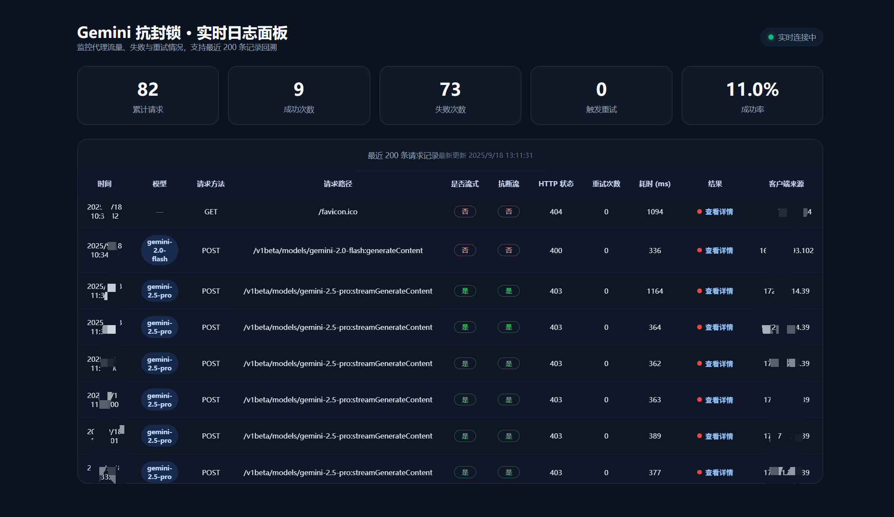

# Gemini Antiblock Proxy (Go Edition)



This is a Gemini API proxy server rewritten in Go, featuring robust streaming retry and standardized error response capabilities. It can process the model's "thinking" process and filter thought content after retries to maintain clean output streams.

## Features

- **Streaming Response Handling**: Support for Server-Sent Events (SSE) streaming responses
- **Intelligent Retry Mechanism**: Automatic retry on stream interruptions, supporting up to 100 consecutive retries
- **Thought Content Filtering**: Filter model's thinking process after retries to keep output clean
- **Standardized Error Responses**: Google API standard-compliant error response format
- **CORS Support**: Complete Cross-Origin Resource Sharing support
- **Rate Limiting**: Configurable request rate limiting functionality
- **Detailed Logging**: Debug mode support with comprehensive operational logs

## Quick Start

### Using Docker (Recommended)

#### Method 1: Using Pre-built Images (Automatic Multi-Architecture)

```bash
# Pull and run (automatically selects the image matching your CPU architecture)
docker run -d \
  --name gemini-antiblock \
  -p 8080:8080 \
  -e UPSTREAM_URL_BASE=https://generativelanguage.googleapis.com \
  ghcr.io/qlhazycoder/gemini-antiblock-spectre-proxy:latest

# Use specific version
docker run -d \
  --name gemini-antiblock \
  -p 8080:8080 \
  -e UPSTREAM_URL_BASE=https://generativelanguage.googleapis.com \
  ghcr.io/qlhazycoder/gemini-antiblock-spectre-proxy:v1.0.0
```

> **Supported Architectures**: `linux/amd64` (x86_64) and `linux/arm64` (ARM64/Apple Silicon)
> Docker automatically pulls the image matching your system architecture.

#### Method 2: Using Docker Compose

```bash
git clone https://github.com/QLHazyCoder/gemini-antiblock-spectre-proxy.git
cd gemini-antiblock-spectre-proxy
docker-compose up -d
```

> Before first run, execute `cp .env.example .env` and fill in required variables (SpectreProxy / API Key, etc.). Compose will automatically read them.

#### Method 3: Local Build

```bash
git clone https://github.com/QLHazyCoder/gemini-antiblock-spectre-proxy.git
cd gemini-antiblock-spectre-proxy
docker build -t gemini-antiblock-spectre-proxy .
docker run -d --name gemini-antiblock -p 8080:8080 gemini-antiblock-spectre-proxy
```

### Running from Source

```bash
# Prerequisites: Go 1.21+
git clone https://github.com/QLHazyCoder/gemini-antiblock-spectre-proxy.git
cd gemini-antiblock-spectre-proxy
go mod download
go run main.go
```

---

## 💡 Lightweight Deployment

This project has extremely low resource consumption and can run smoothly on **1 core CPU + 512MB RAM**, making it ideal for small VPS deployments.

### Recommended Companion Tools

- **[Caddy](https://caddyserver.com/)**: Provides automatic HTTPS and reverse proxy
- **[3x-ui](https://github.com/MHSanaei/3x-ui)**: Proxy management panel, perfectly complements this project

### ⚠️ Important Server Region Selection

**You must deploy the server in regions not restricted by Gemini**. Even when using Cloudflare Worker reverse proxy, having the source server in restricted regions (such as mainland China) may still cause API call failures.

Recommended regions: 🇺🇸 United States, 🇪🇺 Europe, 🇯🇵 Japan, 🇸🇬 Singapore

---

## Configuration

### Environment Variables

| Variable Name                  | Default Value                               | Description                       |
| ------------------------------ | ------------------------------------------- | --------------------------------- |
| `UPSTREAM_URL_BASE`            | `https://generativelanguage.googleapis.com` | Base URL for Gemini API; if empty and Spectre is configured, will auto-concatenate |
| `SPECTRE_PROXY_WORKER_URL`     | *(empty)*                                   | SpectreProxy Worker address (optional, supports multiple URLs with automatic rotation) |
| `SPECTRE_PROXY_AUTH_TOKEN`     | *(empty)*                                   | SpectreProxy authentication token (optional) |
| `ANTIBLOCK_MODEL_PREFIXES`     | `gemini-2.5-pro`                            | Model prefixes requiring anti-interruption (comma-separated) |
| `PORT`                         | `8080`                                      | Server listening port             |
| `DEBUG_MODE`                   | `true`                                      | Enable debug logging              |
| `MAX_CONSECUTIVE_RETRIES`      | `100`                                       | Maximum consecutive retries on stream interruption |
| `RETRY_DELAY_MS`               | `750`                                       | Retry interval (milliseconds)     |
| `SWALLOW_THOUGHTS_AFTER_RETRY` | `true`                                      | Filter thought content after retry |
| `ENABLE_RATE_LIMIT`            | `false`                                     | Enable rate limiting              |
| `RATE_LIMIT_COUNT`             | `10`                                        | Rate limit request count          |
| `RATE_LIMIT_WINDOW_SECONDS`    | `60`                                        | Rate limit window time (seconds)  |
| `ENABLE_PUNCTUATION_HEURISTIC` | `true`                                      | Enable sentence-ending punctuation heuristic |

> 💡 If forwarding through Cloudflare SpectreProxy, you can additionally declare `SPECTRE_PROXY_WORKER_URL` and `SPECTRE_PROXY_AUTH_TOKEN` in `.env`, and leave `UPSTREAM_URL_BASE` empty. The application will automatically concatenate `https://<WORKER>/<AUTH_TOKEN>/gemini`. `SPECTRE_PROXY_WORKER_URL` supports multiple addresses separated by commas, semicolons, or newlines, and the system will automatically rotate requests to distribute Cloudflare free tier pressure.

### Configuration File

Create configuration from example file:

```bash
cp .env.example .env
```

### Complete Docker Configuration Example

```bash
docker run -d \
  --name gemini-antiblock \
  -p 8080:8080 \
  -e UPSTREAM_URL_BASE=https://generativelanguage.googleapis.com \
  -e ANTIBLOCK_MODEL_PREFIXES=gemini-2.5-pro \
  -e PORT=8080 \
  -e DEBUG_MODE=false \
  -e MAX_CONSECUTIVE_RETRIES=100 \
  -e RETRY_DELAY_MS=750 \
  -e SWALLOW_THOUGHTS_AFTER_RETRY=true \
  -e ENABLE_RATE_LIMIT=false \
  -e RATE_LIMIT_COUNT=10 \
  -e RATE_LIMIT_WINDOW_SECONDS=60 \
  -e ENABLE_PUNCTUATION_HEURISTIC=true \
  ghcr.io/qlhazycoder/gemini-antiblock-spectre-proxy:latest
```

## Usage

After the proxy server starts, you can send Gemini API requests to this proxy server. The proxy will automatically:

1. Forward requests to upstream Gemini API
2. Handle streaming responses
3. Automatically retry on stream interruptions
4. Inject system prompt to ensure responses end with `[done]`
5. Filter thought content after retries (if enabled)

### Example Request

```bash
curl "http://127.0.0.1:8080/v1beta/models/gemini-2.5-flash:streamGenerateContent?alt=sse" \
   -H "x-goog-api-key: $GEMINI_API_KEY" \
   -H 'Content-Type: application/json' \
   -X POST --no-buffer  -d '{
    "contents": [
      {
        "role": "user",
        "parts": [
          {
            "text": "Hello"
          }
        ]
      }
    ],
    "generationConfig": {
      "thinkingConfig": {
        "includeThoughts": true
      }
    }
  }'
```

### Health Check

```bash
curl http://localhost:8080/health
```

## Project Structure

```
gemini-antiblock-spectre-proxy/
├── main.go                 # Main program entry
├── config/
│   └── config.go          # Configuration management
├── logger/
│   └── logger.go          # Logging
├── handlers/
│   ├── errors.go          # Error handling and CORS
│   ├── health.go          # Health check
│   ├── proxy.go           # Proxy handling logic
│   └── ratelimiter.go     # Rate limiting
├── streaming/
│   ├── sse.go             # SSE stream processing
│   └── retry.go           # Retry logic
├── mock-server/           # Test mock server
├── Dockerfile             # Docker build file
├── docker-compose.yml     # Docker Compose configuration
└── README.md              # Project documentation
```

## Advanced Features

### SpectreProxy Worker (Optional)

The repository includes a `SpectreProxy/` directory providing a SpectreProxy implementation based on Cloudflare Workers native Socket connection, capable of building upstream forwarding at `https://<WORKER>/<AUTH_TOKEN>/gemini`.

Usage:

1. Deploy `AIGatewayWithSocks.js` following instructions in `SpectreProxy/README.md` (supports one-click deployment of multiple Workers).
2. Fill in `SPECTRE_PROXY_WORKER_URL` (supports multiple addresses) and `SPECTRE_PROXY_AUTH_TOKEN` in `.env`, and leave `UPSTREAM_URL_BASE` empty; the application will automatically concatenate and rotate SpectreProxy upstreams.
3. If not using SpectreProxy, directly set `UPSTREAM_URL_BASE` to the official `https://generativelanguage.googleapis.com` or any custom upstream.

> SpectreProxy uses MIT license and retains copyright of original author Davidasx. Please read the README in the directory to learn more about features and limitations.

### Retry Mechanism

The proxy automatically retries when detecting the following conditions:

1. **Stream Interruption**: Stream ends unexpectedly without completion marker
2. **Blocked Content**: Content filtering or blocking detected
3. **Completion During Thinking**: Completion marker detected in thinking block (invalid state)
4. **Abnormal Finish Reason**: Non-normal completion reason
5. **Incomplete Response**: Response appears incomplete

During retry, it will:

- Preserve generated text as context
- Build new request to continue conversation
- Return error after reaching maximum retry count

### Logging

The proxy provides three levels of logging:

- **DEBUG**: Detailed debugging information (only in debug mode)
- **INFO**: General information and operational status
- **ERROR**: Error messages and exceptions

### Testing and Development

The project includes a Mock Server for testing, supporting various test scenarios:

```bash
cd mock-server
go run main.go
```

For detailed testing instructions, refer to [`mock-server/README.md`](mock-server/README.md).

## Production Deployment

### Production Environment Recommendations

1. **Use Specific Version Tags**

   ```bash
   docker pull ghcr.io/qlhazycoder/gemini-antiblock-spectre-proxy:v1.0.0
   ```

2. **Set Resource Limits**

   ```bash
   docker run -d \
     --name gemini-antiblock \
     --memory=256m \
     --cpus=0.5 \
     -p 8080:8080 \
     ghcr.io/qlhazycoder/gemini-antiblock-spectre-proxy:v1.0.0
   ```

3. **Enable Rate Limiting**

   ```bash
   -e ENABLE_RATE_LIMIT=true \
   -e RATE_LIMIT_COUNT=100 \
   -e RATE_LIMIT_WINDOW_SECONDS=60
   ```

4. **Configure Monitoring**
   - Health check: `/health` endpoint
   - Log rotation: Avoid oversized log files
   - Restart policy: Ensure high availability

### Multi-Architecture Support

Docker images support:

- `linux/amd64` (x86_64)
- `linux/arm64` (ARM64)

### CI/CD

The project uses GitHub Actions for automated building and publishing:

- **Trigger Conditions**: Push to `main`/`master` branch or create tags
- **Build Platforms**: Support `linux/amd64` and `linux/arm64`
- **Publish Location**: `ghcr.io/qlhazycoder/gemini-antiblock-spectre-proxy`

#### View Build Status

Visit the project's [Actions page](https://github.com/QLHazyCoder/gemini-antiblock-spectre-proxy/actions) to view the latest build status.

#### Version Release Process

1. **Development Version (latest)**
   ```bash
   git add .
   git commit -m "feat: add new feature"
   git push origin main  # Automatically builds and pushes :latest tag
   ```

2. **Stable Version Release**
   ```bash
   git tag v1.2.0
   git push origin v1.2.0  # Automatically builds and pushes :v1.2.0 and :latest tags
   ```

3. **Create GitHub Release**
   - Go to the repository's [Releases page](https://github.com/QLHazyCoder/gemini-antiblock-spectre-proxy/releases)
   - Click "Create a new release"
   - Select the corresponding tag
   - Fill in release notes
   - Publish release

#### Local Build (Development and Debugging)

```bash
# Clone repository
git clone https://github.com/QLHazyCoder/gemini-antiblock-spectre-proxy.git
cd gemini-antiblock-spectre-proxy

# Build multi-architecture image
docker buildx build --platform linux/amd64,linux/arm64 -t my-proxy:latest .

# Build single architecture (faster)
docker build -t my-proxy:latest .
```

## License

This project is licensed under the MIT License - see the [LICENSE](LICENSE) file for details.

## Contributing

Contributions are welcome! Please feel free to submit a Pull Request.

## Acknowledgments

- Inspired by the original Python implementation
- SpectreProxy by [Davidasx](https://github.com/davidasx)
- Community contributors

## Contact

For questions or issues, please open an issue on GitHub.
